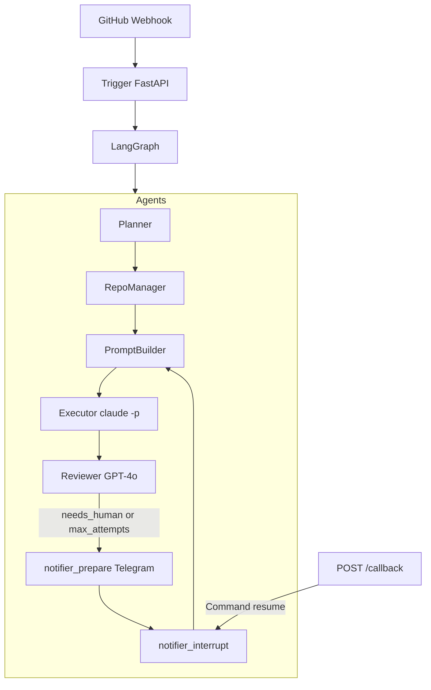

# Jannus

**Jannus** is a **multi-agent** system: GitHub webhooks feed a **LangGraph** orchestrator (planner → repo workspace → prompt → **Claude Code** CLI → reviewer → optional human-in-the-loop via **Telegram**). **LangSmith** traces runs when configured. Optional **LlamaIndex + Chroma** RAG augments prompts.

## Architecture



| Layer | Location | Role |
|-------|----------|------|
| Trigger | [`jannus/trigger/`](jannus/trigger/) | `POST /webhook` (GitHub HMAC), `POST /callback` (resume after human input) |
| Orchestration | [`jannus/agents/graph.py`](jannus/agents/graph.py) | LangGraph + SQLite checkpoints |
| Agents | [`jannus/agents/`](jannus/agents/) | Planner, repo clone/pull, prompt, executor, reviewer, notifier |
| RAG (optional) | [`jannus/rag/`](jannus/rag/) | LlamaIndex + Chroma under `workspaces/.chroma/` |

Persistent clones live in **`workspaces/`** (gitignored except `.gitkeep`), e.g. `workspaces/owner--repo/`.

## Requirements

- Python 3.10+ (3.12+ recommended; 3.14 may show LangChain pydantic warnings)
- [Claude Code](https://docs.anthropic.com/) CLI (`claude` on `PATH`)
- OpenAI API key recommended (planner + reviewer heuristics work without it, with lower quality)

## Quick start

```bash
cd /path/to/Jannus
python3 -m venv .venv
source .venv/bin/activate
pip install -r requirements.txt
cp .env.example .env
# Edit .env: WEBHOOK_SECRET, OPENAI_API_KEY, TELEGRAM_* if needed
python -m jannus
```

- Health: `GET /health`
- GitHub webhook: `POST /webhook`
- Resume after Telegram / manual human input: `POST /callback` with JSON `{"thread_id": "<id from webhook response>", "message": "your guidance"}`

## Environment variables

| Variable | Description |
|----------|-------------|
| `WORKSPACES_DIR` | Directory for git clones + SQLite checkpoint DB (default: `./workspaces`) |
| `WEBHOOK_SECRET` | GitHub webhook secret; empty skips signature check (dev only) |
| `EVENT_ALLOWLIST` | Comma-separated GitHub events; empty allows all handled types |
| `REPO_ALLOWLIST` | Comma-separated `owner/repo`; empty allows any |
| `TRIGGER_KEYWORDS` | Substrings required in `issue_comment` bodies |
| `WEBHOOK_DRY_RUN` | If `true`, skips real `git`/`claude` (still runs graph) |
| `MAX_ATTEMPTS` | Review loop limit before escalating to human path |
| `CLAUDE_BIN`, `CLAUDE_EXTRA_ARGS`, `CLAUDE_TIMEOUT` | Claude Code invocation |
| `OPENAI_API_KEY`, `OPENAI_MODEL` | Planner and reviewer LLM |
| `LANGCHAIN_TRACING_V2`, `LANGCHAIN_API_KEY`, `LANGCHAIN_PROJECT` | LangSmith tracing |
| `TELEGRAM_BOT_TOKEN`, `TELEGRAM_CHAT_ID` | Notifications before `interrupt()` |
| `RAG_ENABLED` | `true` requires `pip install -r requirements-rag.txt` |

## LangSmith

Set `LANGCHAIN_TRACING_V2=true` and `LANGCHAIN_API_KEY` (and optionally `LANGCHAIN_PROJECT`). Graph and LLM calls are traced at [smith.langchain.com](https://smith.langchain.com).

## Optional RAG

```bash
pip install -r requirements-rag.txt
# In .env:
RAG_ENABLED=true
```

Uses OpenAI embeddings; indexes live under `workspaces/.chroma/`.

## GitHub webhook setup

1. Repository **Settings → Webhooks → Add webhook**
2. Payload URL: `https://your-host/webhook`
3. Content type: `application/json`
4. Secret: match `WEBHOOK_SECRET`
5. Select events: e.g. Push, Issues, Issue comments, Workflow runs, Check suites

The server responds **202** with a `thread_id` (GitHub delivery id) for correlation with LangSmith and `/callback`.

## Project layout

```
jannus/
  agents/       # LangGraph nodes (planner, repo_manager, prompt_builder, executor, reviewer, notifier)
  rag/          # Optional LlamaIndex + Chroma
  trigger/      # FastAPI webhook + callback
  config.py
workspaces/     # Clones + .jannus_state.db (ignored)
```

## License

Per repository license if present.
