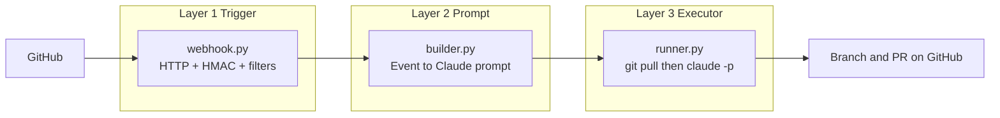

# Jannus

**Jannus** nhận sự kiện từ GitHub (webhook), cập nhật bản clone local (`git pull`), rồi gọi **Claude Code** qua CLI (`claude -p "<prompt>"`) để phân tích và sửa code theo quy tắc an toàn (branch mới, PR, không đụng secrets).

## Kiến trúc (3 lớp)

Luồng xử lý: **Trigger → Prompt → Executor**.



| Layer | Package | Trách nhiệm |
|-------|---------|-------------|
| **1. Trigger** | [`jannus/trigger/`](jannus/trigger/) | Nhận `POST /webhook`, xác thực chữ ký GitHub, lọc event/repo allowlist. |
| **2. Prompt** | [`jannus/prompt/`](jannus/prompt/) | Chuyển payload GitHub thành chuỗi prompt (kèm quy tắc an toàn); có thể trả `None` để bỏ qua. |
| **3. Executor** | [`jannus/executor/`](jannus/executor/) | `git pull --ff-only`, sau đó chạy `claude -p`; một job tại một thời điểm (khóa). |

## Yêu cầu

- Python 3.10+ (khuyến nghị 3.12+)
- [Claude Code](https://docs.anthropic.com/) đã cài và đăng nhập (`claude` trong `PATH`)
- Một bản clone local của repo GitHub (remote để `git pull` hoạt động)

## Cài đặt nhanh

```bash
cd /path/to/Jannus
python3 -m venv .venv
source .venv/bin/activate   # Windows: .venv\Scripts\activate
pip install -r requirements.txt
cp .env.example .env
# Sửa .env: REPO_PATH= đường dẫn tuyệt đối tới clone repo
```

## Chạy service

```bash
python -m jannus
```

Mặc định lắng nghe `http://0.0.0.0:8765`. Kiểm tra: `GET /health`.

## Cấu hình GitHub Webhook

1. Repo GitHub → **Settings** → **Webhooks** → **Add webhook**
2. **Payload URL**: `https://<host-công-khai>/webhook` (dev có thể dùng [ngrok](https://ngrok.com/))
3. **Content type**: `application/json`
4. **Secret**: giống biến `WEBHOOK_SECRET` trong `.env`
5. Chọn các event cần dùng (ví dụ: **Push**, **Issues**, **Issue comments**, **Workflow runs**, **Check suites**)

Service trả **202 Accepted** khi đã xếp job nền; GitHub không cần chờ Claude chạy xong.

## Biến môi trường

| Biến | Mô tả |
|------|--------|
| `REPO_PATH` | Đường dẫn tuyệt đối tới thư mục git clone (bắt buộc). |
| `HOST` / `PORT` | Bind server (mặc định `0.0.0.0`, `8765`). |
| `WEBHOOK_SECRET` | Secret webhook GitHub; để trống chỉ dùng khi dev (không xác thực chữ ký). |
| `EVENT_ALLOWLIST` | Danh sách event, cách nhau bởi dấu phẩy; rỗng = chấp nhận mọi event được hỗ trợ. |
| `REPO_ALLOWLIST` | Chỉ chấp nhận `owner/repo` trong danh sách; rỗng = mọi repo. |
| `TRIGGER_KEYWORDS` | Với **Issue comment**: comment phải chứa một trong các chuỗi (mặc định `/fix`, `/autofix`, `@jannus`). |
| `WEBHOOK_DRY_RUN` | `true` = chỉ log prompt, không `git pull` / không gọi `claude`. |
| `CLAUDE_BIN` | Tên lệnh CLI (mặc định `claude`). |
| `CLAUDE_EXTRA_ARGS` | Thêm tham số sau `-p`, cách nhau khoảng trắng (ví dụ `--max-turns 20`). |
| `CLAUDE_TIMEOUT` | Timeout giây cho tiến trình Claude (mặc định `600`). |

## Sự kiện được xử lý

| Event | Hành vi tóm tắt |
|-------|-----------------|
| `push` | Prompt theo ref và commit messages. |
| `issues` | `opened`, `reopened`, `labeled`, `assigned` → prompt theo title/body issue. |
| `issue_comment` | Chỉ `created` **và** comment khớp `TRIGGER_KEYWORDS` → prompt theo issue + comment. |
| `workflow_run` | Kết thúc với kết luận lỗi → prompt theo log/branch. |
| `check_suite` | Kết luận lỗi → prompt điều tra CI. |
| Khác | Fallback: gửi payload rút gọn cho Claude đánh giá. |

### Ví dụ comment để kích hoạt

Trong issue hoặc PR, comment có chứa một từ khóa, ví dụ:

- `/fix lỗi null ở getUser`
- `/autofix`
- `@jannus hãy sửa test fail`

Có thể tùy chỉnh qua `TRIGGER_KEYWORDS` (phân tách bằng dấu phẩy).

## Cấu trúc thư mục

```
jannus/
  __init__.py
  __main__.py          # python -m jannus
  config.py            # Settings + get_settings
  trigger/
    webhook.py         # FastAPI app, POST /webhook
    security.py        # X-Hub-Signature-256
  prompt/
    builder.py         # build_prompt(...)
  executor/
    runner.py          # git pull, claude -p, job lock
```

## License

Theo license của repository này (nếu có).
